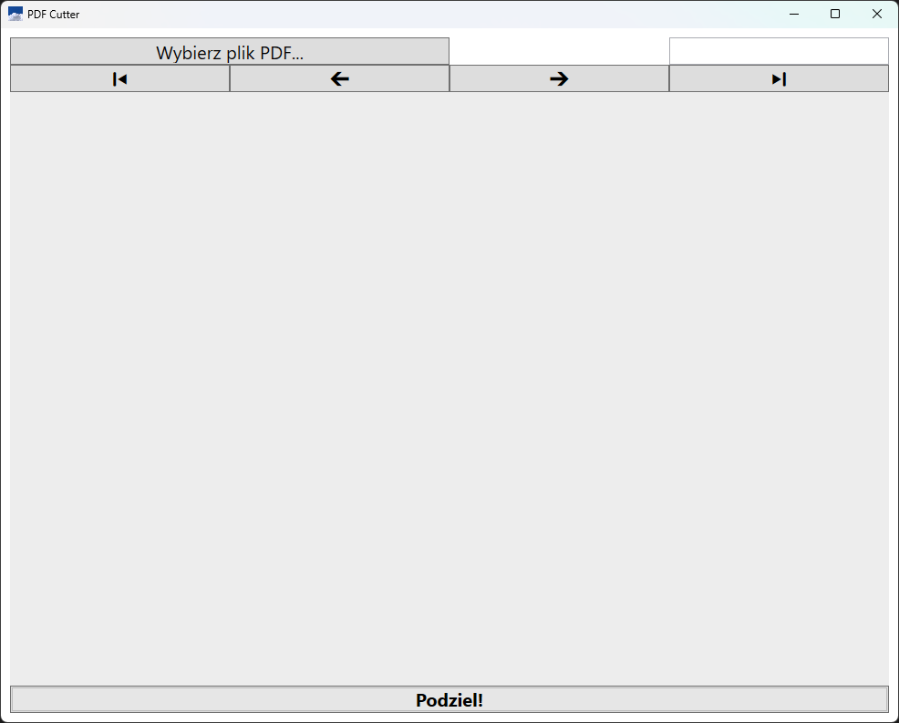
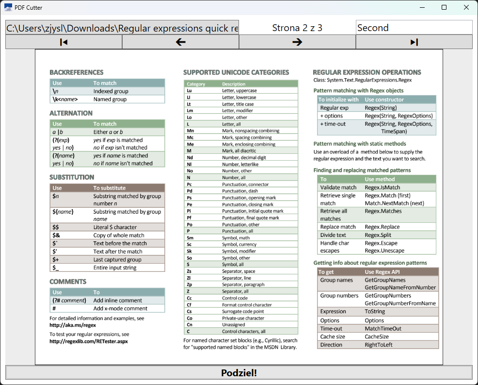

# PDFCutter

This app allows you to cut PDF files into a series of smaller files with names of your choice. It was written to streamline worflow in a company where many pages of invoices were scanned all at once and had to be separated into files with coded file names.

## Technologies used
* C#/.NET
* WPF
* Syncfusion.Windows.PdfViewer

## How to use

1. Select PDF file with an open file dialog.

2. Navigate the file using arrow buttons.

3. When you are on the first page of the part of pdf you want separated, input a filename (without extension) for it into the text box in the upper right corner. Each section starts with the page with a filename in the textbox and includes any subsequent pages until the last page before a next section is started. If you provide the same filename more than once, the last occurance will be the only one saved. 

4. Press **Podziel!** button. When the progress bar insde the button fill it fully, it means that the process is finished.

5. You will find the new files in a new folder `./cut`, where `.` is the location of your input file.

## Screenshots

